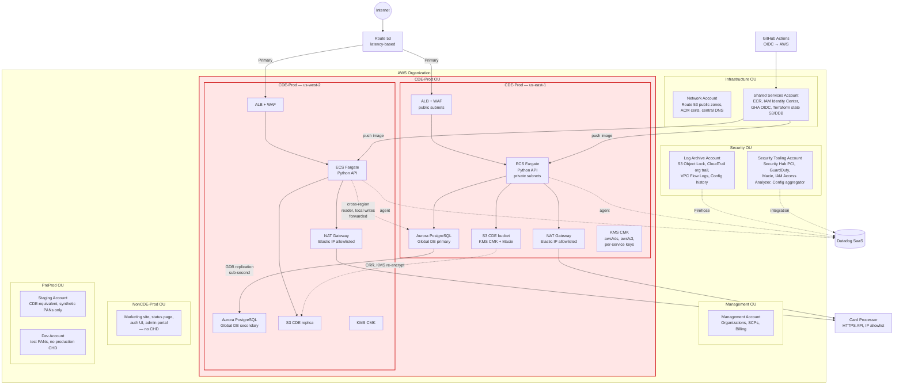
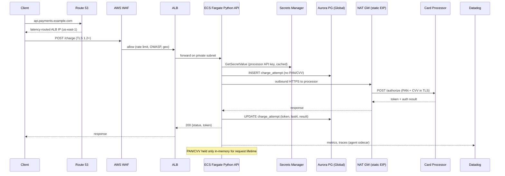

# Payments Platform — AWS Platform Architecture

## Executive summary

- **Full PCI-DSS CDE on ECS Fargate, no EC2.** Fargate removes host-level scope and patching burden; the CDE is a dedicated AWS account per region with zero public ingress except WAF+ALB. Cardholder data at rest lives only in Aurora PostgreSQL Global Database and an encrypted S3 bucket (with Macie), both behind KMS CMKs with rotation and split key administration.
- **Active/active across us-east-1 and us-west-2** using Route 53 latency-based routing with health checks, Aurora Global Database (managed cross-region replication, <1s typical RPO, ~1 minute managed failover), and idempotent write handling at the API layer. RTO target 5 minutes, RPO target <60 seconds.
- **Static egress to the card processor via NAT Gateway with Elastic IPs** in each region, allocated from a dedicated egress VPC so the processor allowlist is stable across deploys. Egress is centralized per region (not cross-region) to keep latency low and avoid cross-region data-plane dependencies in the payment path.
- **Datadog is the single pane of glass** via AWS integration (metrics, CloudTrail, Config) + Datadog Agent sidecar on ECS tasks + CloudWatch Logs subscription filters to Datadog via Kinesis Firehose. CloudWatch remains the source of truth for AWS-native alarms that gate deploys and failover.
- **Small AWS Organization tuned for PCI scope isolation**, not team scale: Management, Security Tooling, Log Archive, Network, Shared Services, CDE-Prod, NonCDE-Prod, Staging, Dev. CDE accounts have the tightest SCPs; everything that can live outside the CDE (static site, marketing, auth UI) is forced to NonCDE-Prod to keep CDE scope minimal.

## Context

Greenfield AWS build for a Python REST payments API handling raw PAN and CVV. Full PCI-DSS CDE required (not SAQ-A). SOC 2 in parallel. Active/active US multi-region (us-east-1, us-west-2), 99.99% target. Cloud-native only (no on-prem, no Direct Connect). Single card acquirer integration over HTTPS with static-egress-IP allowlisting. Greenfield IAM, experienced AWS team, Terraform + GitHub Actions, Datadog for observability. Reliability and security trump cost.

**Explicit assumptions:**

- Card processor integration is synchronous HTTPS; processor supplies a fixed allowlist of our egress IPs per region. No mTLS callback webhooks required from processor initially (added if processor mandates it).
- The API stores PAN + CVV only for the duration of the authorization call, then persists only a processor-issued token + last-4 + BIN. CVV is never persisted at rest. This is a standard PCI pattern; if the team decides to persist PAN (e.g., for recurring billing without processor tokens), a dedicated tokenization vault design is needed — called out as open question.
- No external IdP yet; IAM Identity Center with an internal directory is acceptable for ~10 engineers. Federation can be added later without structural change.
- "Active/active" means both regions take live write traffic partitioned by Route 53 latency routing; Aurora Global Database provides a single writer with a managed failover primary switch. True multi-master writes are out of scope — called out below.
- Team is small and experienced; Control Tower / Landing Zone Accelerator is not used. Organizations + a lean Terraform baseline is sufficient and avoids the LZA opinionated sprawl that would over-serve a 9-account org.

## Component diagram

## Data / control flow — payment authorization

## Design

### Accounts & OUs

**What.** Nine accounts across five OUs:

| OU | Accounts | Purpose |
|---|---|---|
| Management | Management | Organizations root, consolidated billing, SCP authorship. No workloads. |
| Security | Log Archive, Security Tooling | Immutable log sink; Security Hub/GuardDuty/Macie/Config aggregator. |
| Infrastructure | Network, Shared Services | Public DNS + ACM; ECR, IAM Identity Center, Terraform state, GHA OIDC. |
| CDE-Prod | CDE-Prod | Single account, resources in both us-east-1 and us-west-2. PCI in-scope. |
| NonCDE-Prod | NonCDE-Prod | Marketing, status, admin UI, anything that does not touch CHD. |
| PreProd | Staging, Dev | Staging mirrors CDE topology with synthetic PANs; dev is looser. |

**Why.** PCI scope reduction is the dominant constraint. A dedicated CDE account gives us a hard SCP boundary ("no public S3, no IAM user creation, deny non-FIPS endpoints, deny non-KMS-encrypted storage"), a clean CloudTrail filter for auditors, and unambiguous answers for "what is in scope." Two-region resources live in one account to keep Aurora Global Database and cross-region IAM simple.

**Alternatives rejected.**
- *Account-per-region for the CDE.* Doubles IAM surface, complicates Global DB IAM and KMS grants, and gains little scope isolation (both regions are in-scope regardless).
- *Control Tower / LZA.* Overkill for 9 accounts and an experienced team. Reintroduce if the org grows past ~25 accounts.
- *Mixing CDE and non-CDE in one prod account.* Would put marketing, analytics, and admin tooling in PCI scope. Non-starter.

**Tradeoffs.** Small org means less blast-radius isolation between workstreams; acceptable given one product and one team. Adding a second product later means a second CDE-Prod account, not reorganizing this one.

### Identity & access

**What.** IAM Identity Center in the Shared Services account with an internal directory. Permission sets mapped to groups: `PlatformAdmin`, `PaymentsEngineer`, `PaymentsReadOnly`, `SecurityAuditor`, `BillingReadOnly`. No IAM users anywhere; SCP denies `iam:CreateUser` and `iam:CreateAccessKey` org-wide. Human CDE access requires MFA and is break-glass only (session duration 1h, all commands logged via CloudTrail + Session Manager logging to S3 + Datadog). GitHub Actions uses OIDC to assume per-env deployment roles; no stored AWS keys in GitHub.

Permission boundaries on all engineer-assumable roles prevent privilege escalation (cannot create roles without the boundary, cannot detach the boundary). KMS key policies enforce separation: `PaymentsEngineer` can `Encrypt/Decrypt/GenerateDataKey` via grants issued by services, but cannot `ScheduleKeyDeletion` or modify key policy — that requires `PlatformAdmin` + a second approver via break-glass.

**Why.** PCI-DSS 7.x (least privilege) and 8.x (unique IDs, MFA, no shared accounts). SOC 2 CC6 (logical access). Federating to an external IdP later is a swap of the Identity Center identity source — no structural change.

**Alternatives rejected.** Direct IAM users per engineer (PCI-painful, key rotation overhead, audit nightmare). Skipping permission boundaries (real risk of escalation given engineers can assume admin-adjacent roles in dev).

**Tradeoffs.** Internal IDC directory means IDC is the IdP of record — if the company gets Okta/Entra later, user migration is manual. Acceptable at this scale.

### Networking

**What.** Per region in CDE-Prod, a `/20` VPC with:

- 3 public subnets (one per AZ) — ALB and NAT Gateways only.
- 3 private app subnets — ECS Fargate tasks.
- 3 private data subnets — Aurora, ElastiCache (if added), VPC endpoints.
- 3 NAT Gateways (one per AZ) each with a pre-allocated Elastic IP. All 3 EIPs per region given to the processor for allowlisting (6 total across both regions).
- VPC endpoints (interface) for: ECR (api + dkr), Secrets Manager, KMS, STS, CloudWatch Logs, SSM, ECS agent. Gateway endpoint for S3.
- No internet gateway route from private subnets — the only egress path is NAT → processor (and NAT → AWS public endpoints where VPC endpoints don't exist, which should be zero).
- VPC Flow Logs (ACCEPT + REJECT) to the Log Archive account S3 with Object Lock.

No Transit Gateway. CDE talks to nothing in NonCDE or PreProd — any cross-VPC dependency would pull the peer into PCI scope. Staging/Dev/NonCDE get their own small VPCs; no peering.

**Why.** Flat, small network. AZ-local NAT avoids cross-AZ data charges and gives AZ-level blast-radius isolation. Three EIPs per region (not one) means we can lose an AZ without losing all egress to the processor; the processor already has all three allowlisted.

Interface endpoints are non-negotiable: without them, Fargate pulls ECR images and Secrets Manager values over NAT, which (a) needlessly routes CHD-adjacent traffic through NAT and (b) costs more than the endpoint charges at steady state.

**Alternatives rejected.**
- *Single NAT per region.* Cheaper but AZ-failure takes all egress offline; unacceptable for 99.99%.
- *Transit Gateway hub.* No cross-VPC need today; adding TGW would create a tempting path that dilutes PCI boundary.
- *AWS Network Firewall centralized egress.* Real value at scale; for a single egress target (one processor), security groups + VPC-level egress rules + WAF cover it. Revisit if we add >3 third-party integrations.
- *PrivateLink to processor.* Processor doesn't offer it; static-EIP allowlisting is the contract.

**Tradeoffs.** Static EIPs are a coupling: rotating them means coordinated change with the processor. Mitigated by never-delete on EIPs and documenting the rotation runbook.

### Security & guardrails

**What.**

- **SCPs on CDE-Prod OU:** deny `iam:CreateUser`, `iam:CreateAccessKey`, `iam:CreateLoginProfile`; deny unencrypted S3 put (`s3:PutObject` without `s3:x-amz-server-side-encryption=aws:kms`); deny S3 public access grants; deny `ec2:RunInstances` (Fargate-only — this is the hard boundary for PCI host-scope exclusion); deny disabling of CloudTrail, Config, GuardDuty; deny KMS key deletion without a schedule >30d; deny use of regions other than us-east-1, us-west-2, us-east-2 (for DR option).
- **Security Hub** with PCI-DSS v3.2.1 standard (v4 once fully supported), AWS Foundational Security Best Practices, and CIS 1.4 enabled org-wide, aggregated in Security Tooling account.
- **GuardDuty** enabled with S3 Protection, EKS Protection (future-proof), Malware Protection, RDS Protection — the latter catches anomalous Aurora logins.
- **Macie** enabled on the CDE S3 bucket and Log Archive to flag any PAN patterns that leak into logs or unexpected locations.
- **IAM Access Analyzer** at the org level to flag any resource policy that allows external access; findings to Security Hub.
- **AWS Config** with conformance packs: PCI-DSS, Operational-Best-Practices-for-Encryption-and-KeyManagement. Auto-remediation for a narrow set (unencrypted EBS, public S3) via SSM Automation.
- **AWS WAF** on every ALB: AWS managed rule groups (Core, Known Bad Inputs, SQLi, Linux, Admin Protection), rate-based rule at 2000 req/5min per IP, custom rule blocking non-US geographies if the business allows (confirm).
- **KMS** customer-managed keys per data domain: `cde/aurora`, `cde/s3`, `cde/secrets`, `cde/logs`. All with annual automatic rotation. Key policies grant service principals + narrow IAM role ARNs only. Multi-region keys for `cde/s3` so S3 CRR works without re-wrap, single-region keys for the rest (Aurora GDB handles its own cross-region encryption via a key per region).
- **Secrets Manager** for processor API credentials, DB passwords, Datadog API key, JWT signing keys. Automatic rotation enabled for DB; processor key rotation is manual on a calendar (processor-driven).
- **CloudTrail** — org trail, multi-region, management + data events (S3 data events on CDE bucket, Lambda invoke, KMS Decrypt) to Log Archive S3 with Object Lock in Compliance mode, 7-year retention (PCI requires 1 year hot + 1 year available; we over-retain deliberately for SOC 2 and litigation-hold flexibility).

**Why.** PCI-DSS 3.x (protect stored CHD), 4.x (encrypt in transit), 6.x (secure systems), 10.x (track and monitor), 11.x (regularly test). SOC 2 CC6/CC7.

**Alternatives rejected.**
- *Third-party WAF (Cloudflare, Imperva).* Viable and arguably better rule quality, but adds a vendor in the CDE traffic path and a TLS termination hop to reason about for auditors. AWS WAF keeps the story simple. Revisit if attack sophistication warrants.
- *Bring-your-own HSM (CloudHSM).* KMS with CMKs is PCI-DSS eligible (AWS publishes the AOC). CloudHSM is ~$1.5k/month/HSM and operationally heavier. Only justified if the processor or a future tokenization vault mandates FIPS 140-2 L3 under our custody — open question.

**Tradeoffs.** PCI conformance pack in Config will produce noisy findings for the first 2–3 weeks; budget time to triage and suppress what's inapplicable.

### Observability

**What.** Datadog is primary for engineer-facing dashboards and alerting:

- **Datadog AWS integration** (role-based, no access keys) in every account for CloudWatch metrics, CloudTrail events, Config, and AWS service inventory.
- **Datadog Agent as a sidecar** in each ECS Fargate task definition with APM, DogStatsD, and trace collection. Python app uses `ddtrace` auto-instrumentation.
- **Log pipeline:** app stdout → awslogs driver → CloudWatch Logs → subscription filter → Kinesis Firehose → Datadog log intake. CloudWatch Logs retained 30 days; long-term retention is S3 Log Archive (7 years). Datadog log retention is 15 days hot, indexed only for error/warn + payment-critical logs (cost control).
- **Custom metrics:** `payments.authorize.count`, `payments.authorize.latency`, `payments.authorize.processor_error_rate`, `payments.authorize.decline_rate`, `payments.idempotency.collision_count`. SLOs in Datadog: 99.95% success (excluding legitimate declines), p99 latency < 800ms.
- **CloudWatch alarms** remain for AWS-native conditions that gate automation: ALB 5xx > threshold, Aurora replica lag, NAT port exhaustion. These trigger SNS → PagerDuty, and also surface in Datadog.
- **Synthetic checks** from Datadog hitting `/health` and a test `/charge` with a sandbox PAN in each region every 60s.

**Why.** Single pane of glass with Datadog matches team preference and avoids fragmentation. CloudWatch stays in the loop because (a) it's the free-tier source of truth for ALB/NLB/Aurora metrics, (b) some alarms need to act before Datadog's ingestion delay (~30–60s), and (c) PCI auditors want to see AWS-native logging, not just a third-party dashboard.

**Alternatives rejected.** All-Datadog without CloudWatch Logs retention — breaks the auditor narrative. CloudWatch-only — team already pays for Datadog and wants APM/RUM.

**Tradeoffs.** Datadog cost grows with containers, custom metrics, and log volume. Indexed-only-on-error logs is the main lever; revisit if the bill surprises.

### Compute & workload landing pattern

**What.** ECS on Fargate, not EKS, not EC2. One ECS cluster per region in CDE-Prod. Python API packaged as a container, served by Gunicorn+Uvicorn workers behind an internal target group on an internet-facing ALB (WAF attached). Minimum 3 tasks per region (one per AZ), autoscaling on ALB request count per target and CPU. Task role scoped to the specific Secrets Manager ARNs and KMS keys it needs; execution role scoped to ECR pull + CloudWatch Logs put.

Rolling deploys with minimum-healthy 100% and maximum 200% (extra capacity during deploy). ECS circuit breaker enabled to auto-rollback on failed deploy. Image scanning on push in ECR (enhanced scanning with Inspector).

**Why.** Fargate removes PCI host-scope — no OS patching, no SSH, no shared-tenancy EC2 scope analysis. ECS over EKS because the team doesn't need Kubernetes' workload diversity and EKS adds a control plane, cluster IAM, and CNI complexity that would fight the tight PCI boundary. Lambda was considered; cold starts + harder-to-audit execution environment + 15-min limit rule it out for the main API, though it remains the right choice for edge utilities (e.g., processor webhook receiver if added).

**Alternatives rejected.**
- *EKS.* More flexible, but Kubernetes RBAC on top of IAM on top of SCPs is three audit surfaces. Revisit if the platform hosts >3 services.
- *App Runner.* Opinionated and faster to stand up, but limited VPC egress controls and no fine-grained task-role model that matches PCI IAM expectations.
- *Lambda for main API.* Cold start and concurrency accounting complicate p99 latency commitments on the payment path.

**Tradeoffs.** Fargate is ~20–30% more expensive than equivalent EC2 at full utilization. Accepted for scope reduction and ops simplicity.

### Data, backup, DR

**What.**

- **Aurora PostgreSQL Global Database** with primary in us-east-1 and secondary (read-only headless cluster promoted on failover) in us-west-2. `db.r6g.xlarge` to start, 2 writers (primary region, multi-AZ), 2 readers. Encryption at rest with `cde/aurora` CMK per region (GDB uses per-region keys). Performance Insights with 7-day retention, audit logs to CloudWatch → S3 archive. IAM database authentication for human break-glass; app uses rotated Secrets Manager credentials.
- **Write routing:** all writes go to the us-east-1 writer. The us-west-2 API tier makes write calls to the us-east-1 writer endpoint via AWS's backbone (cross-region latency ~60ms). Reads are region-local. This is not true multi-master — called out as tradeoff.
- **Automated backups:** 35-day retention on the primary cluster, cross-region automated backup copy, plus AWS Backup vault in a separate account (Log Archive or a dedicated Backup account — we use Log Archive to stay lean) with a 7-year cold tier for quarterly snapshots. Vault lock in compliance mode.
- **S3 CDE bucket** (any stored tokenized CHD, receipts, reconciliation files): versioning on, Object Lock in governance mode, SSE-KMS with `cde/s3` multi-region key, bucket policy denying non-TLS and non-CMK uploads, Cross-Region Replication to us-west-2, Macie scanning.
- **RTO 5 min / RPO <60s** for the API tier via Route 53 health-check-driven removal of a failing region.
- **RTO ~1 min / RPO typically <1s, worst case seconds** for Aurora Global Database managed failover. Requires a deliberate operator action or an automated runbook — not automatic. Decision called out as open question.

**Why.** Global Database is the only managed Postgres pattern on AWS that gives sub-minute cross-region failover with sub-second replication lag at payment volumes. The alternative (self-managed logical replication) adds operational risk nobody wants in a CDE.

**Alternatives rejected.**
- *DynamoDB Global Tables.* True active/active writes, strong availability. Rejected because the team is Python-on-Postgres and the payment data model (joins on customer/merchant/charge) is relational. Worth revisiting for idempotency keys and session state.
- *RDS Multi-AZ without Global DB.* No cross-region story; fails the 99.99% target under regional impairment.
- *Aurora with logical replication to a second region.* Operationally hostile; we lose the managed failover primitive.

**Tradeoffs.** Single-writer GDB means the us-west-2 region serves reads locally but writes cross-region; a true us-east-1 outage where we lose the writer forces a failover (RTO ~1 min, small data loss possible). Honest statement: 99.99% is achievable with this design assuming a correctly-tested failover runbook; without testing, real achieved availability will drift toward 99.9%.

### CI/CD integration

**What.** GitHub Actions with OIDC to AWS. One repo per service (API + infra) for now. Pipeline:

1. Push to feature branch → lint, unit tests, `pip-audit`, `bandit`, `trivy` on the built image, `checkov` on Terraform.
2. PR merge to `main` → build image → push to ECR in Shared Services → Terraform plan against Staging → auto-apply to Staging → integration tests against processor sandbox.
3. Manual approval (two reviewers, one outside the code author) → Terraform plan against CDE-Prod us-east-1 → apply → ECS deploy → canary 10% → auto-promote on SLO hold → repeat us-west-2 with 15-minute bake.
4. Terraform state in S3 (Shared Services) with DynamoDB locking; separate state file per account/region; state bucket has versioning, KMS, and replication to us-west-2.

OIDC trust policy is scoped by repo + branch + environment — `ref:refs/heads/main` + `environment:cde-prod` required for the prod role.

**Why.** Two-reviewer approval on CDE-Prod satisfies PCI-DSS 6.4 separation of duties. Image scanning + IaC scanning + dependency scanning cover 6.3.

**Alternatives rejected.** Self-hosted GHA runners in AWS (complexity not justified at this scale; GitHub-hosted runners via OIDC suffice). Terraform Cloud (adds a vendor in the deploy path; S3/DDB is well-understood).

**Tradeoffs.** GitHub-hosted runners mean our build traffic originates from GitHub's IP ranges, not ours — fine because builds don't touch CHD.

## Well-Architected mapping

### Operational Excellence
- IaC everything (Terraform); no click-ops in CDE (SCP denies console write for non-break-glass roles).
- Datadog dashboards + SLOs per service; PagerDuty integration; runbooks in repo alongside code.
- ECS circuit breaker + canary + auto-rollback shortens MTTR on bad deploys.
- Game days quarterly: region failover, processor outage simulation, credential rotation drill.
- **Honest gap:** no chaos engineering tooling selected yet (FIS is a candidate). Failover correctness is assumed, not continuously validated.

### Security
- Dedicated CDE account with strict SCPs; Fargate-only (no EC2) eliminates host scope.
- KMS CMKs per data domain with rotation; key policies separate use from admin.
- WAF + GuardDuty + Macie + Security Hub (PCI pack) + Config + Access Analyzer + CloudTrail org trail to Object-Locked S3.
- OIDC deployment (no long-lived keys), MFA required, permission boundaries on all engineer roles.
- VPC endpoints keep AWS-service traffic off the NAT path.
- **Honest gap:** no WAF rule tuning history yet; AWS managed rules have false-positive rates on payment APIs (especially the SQLi rule on free-form merchant fields). First two weeks in staging will burn on this.

### Reliability
- Active/active across two regions; Route 53 latency routing with health checks.
- Aurora Global Database, sub-minute managed failover, cross-region backups, AWS Backup vault lock.
- Multi-AZ at every layer; per-AZ NAT Gateway.
- ECS autoscaling; ALB stickiness off (stateless API).
- **Honest gap:** single-writer Global Database means true active/active for writes is not achieved. An outage in the primary region causes a <60s write unavailability window during managed failover. 99.99% target assumes failover runbook works first time; pessimistic realistic availability is 99.95% until failover is drilled.

### Performance Efficiency
- Region-local reads and region-local API serving keep p99 tight for most users.
- Fargate right-sizing via `CPUUtilization` + `ActiveConnectionCount` autoscaling.
- Aurora reader endpoints for read-heavy paths (reconciliation, reporting).
- **Honest tradeoff:** cross-region writes add ~60ms floor to write latency in us-west-2. For a payment API where total latency budget includes a processor round-trip (~300–800ms), this is noise. Stated explicitly.

### Cost Optimization
- Fargate Spot NOT used in CDE (predictability and task stability outrank savings).
- Savings Plans for Fargate after 3 months of steady-state usage.
- VPC endpoints reduce NAT data processing charges (NAT is priced per-GB — big win for ECR pulls).
- Datadog log indexing only on warn/error + payment-critical streams.
- Aurora I/O-Optimized if write volume warrants (switch is runtime-toggleable monthly).
- **Honest trade:** 3 NAT Gateways per region (6 total) at ~$32/month each + data = ~$200/month minimum before traffic. Consolidating to 1 NAT per region would halve egress cost but eliminate AZ-level egress redundancy. Not worth the risk at this SLA.
- **Honest trade:** Fargate premium + GDB + Datadog + WAF puts this at a higher floor than a typical startup API. Brief says cost is not the constraint; documented so nobody is surprised.

### Sustainability
- Fargate packs tasks densely on AWS-managed infra — better utilization than self-managed EC2.
- Graviton (ARM) for Aurora (`r6g`) and Fargate tasks once the Python image is validated on ARM — ~20% less energy per request, same or lower cost.
- Log tiering to S3 Intelligent-Tiering for archive; Glacier Deep Archive for 7-year retention.
- us-east-1 and us-west-2 both have AWS-published sustainability data; us-west-2 runs on a higher renewable mix, but region choice was driven by latency and service availability, not carbon.
- **Honest gap:** active/active duplicates compute and data. Sustainability takes a back seat to reliability for payments. Acknowledged, not apologized for.

## Risks and open questions

1. **PAN persistence decision.** Design assumes processor-issued tokens are sufficient and we never persist PAN at rest. If recurring billing or chargeback flows require our own vault, we need a dedicated tokenization service (candidates: processor-hosted vault, AWS Payment Cryptography, or a self-built vault on CloudHSM). This materially changes KMS and network design.
2. **Aurora Global Database failover automation.** Managed planned failover is one API call; unplanned failover during a region outage is *not* automatic. We need a decision: (a) human-in-the-loop runbook (safer, ~5–10 min RTO), or (b) automated via Route 53 health + Lambda + hardened guardrails (faster, risk of split-brain if health signal is flaky). Default recommendation is (a) until the team has 3 months of operational data.
3. **WAF false-positive tuning on payment endpoints.** AWS managed rules will block legitimate requests with unusual characters in addresses, names, merchant descriptors. Budget 2 weeks of staging traffic shaping before go-live.
4. **Single processor = single point of failure outside AWS.** If the processor has an outage, region-level AWS redundancy does nothing. Multi-processor routing (primary/fallback) is a product decision with significant engineering cost; flag for product leadership.
5. **PCI scope of CI/CD.** GitHub Actions builds images that run in the CDE. PCI QSAs disagree on whether the build pipeline is in-scope for a token-only design. Confirm with QSA before relying on GitHub-hosted runners; if in-scope, self-hosted runners inside AWS become mandatory.

## Cost envelope

**T-shirt size: L** (roughly $12k–$25k/month at steady-state low volume; scales with traffic primarily via Fargate and Datadog).

Top cost drivers:

1. **Aurora Global Database.** Two clusters, multi-AZ, cross-region replication bandwidth, storage + I/O. Typically the largest line item.
2. **Datadog.** Hosts (per container), APM, custom metrics, log ingestion. Grows fastest with traffic.
3. **Fargate.** CPU/memory per task-hour across both regions; Savings Plans after traffic stabilizes.
4. **NAT Gateway + cross-region data transfer.** Per-GB charges add up quickly; VPC endpoints mitigate the AWS-service portion.
5. **WAF + Security Hub + GuardDuty + Config.** Each modest, but cumulative across 9 accounts.

Not a quote — the reliability/security premium is intentional per the brief.
