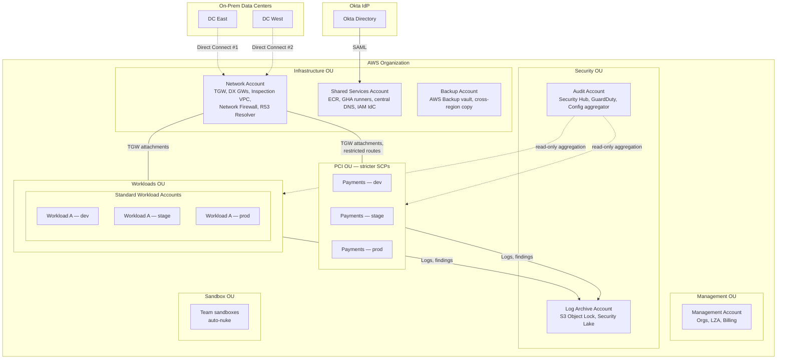
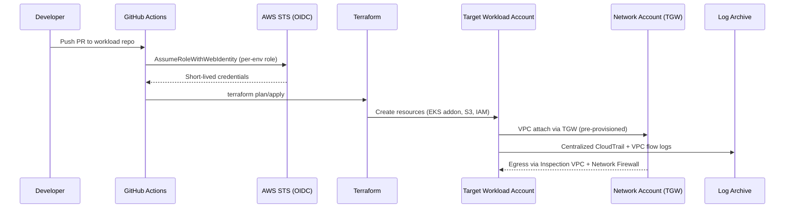

# Claims Platform — AWS Platform Architecture

## Context

Mid-size US insurer migrating claims processing from on-prem to AWS. Greenfield landing zone that must host 8–12 workload teams, reaching ~80 accounts in 24 months.

**Compliance:** PCI-DSS L1 (merchant-adjacent, tokenized payments), HIPAA (covered entity, PHI in claim attachments).
**Regions:** us-east-1 primary, us-west-2 DR.
**Connectivity:** 10 Gbps aggregate to two on-prem data centers via dual Direct Connect in different metros, shrinking over 18 months.
**Identity:** Existing Okta tenant, federated SAML to IAM Identity Center.
**CI/CD:** GitHub Actions, OIDC to AWS.
**IaC:** Terraform.
**NFRs:** Tier-1 claims RTO 4h / RPO 1h (pilot-light DR). Other workloads backup-restore. Medium cost sensitivity — managed services OK, speculative spend not.
**Team:** Solid AWS basics, new to Organizations/Control Tower at scale. Willing to absorb LZA complexity.

**Explicit assumptions:**
- Account-per-workload-per-env plus platform/sandbox → ~80 accounts in 24 months.
- Payment flows isolatable into a dedicated PCI OU; PHI intermixed across workload OUs.
- Centralized egress inspection mandated by PCI auditors' expectations.
- EKS: cluster-per-env (3 per region), multi-tenant via namespaces + network policies.
- Secrets Manager org-wide; no legacy vault to integrate.

## Component diagram

## Workload deploy flow (GitHub Actions → AWS)

## Design

### Accounts & OUs

**Landing Zone Accelerator (LZA)** as the baseline over plain Control Tower — the PCI/HIPAA guardrail pack, centralized logging pipeline, and opinionated OU layout save months of bespoke work and give auditors a recognizable baseline. Trade-off: LZA upgrades require discipline; not trivial to diverge from.

OU layout:
- **Management** — billing, Organizations, LZA pipeline.
- **Security** — Log Archive (immutable), Audit (delegated admin for Security Hub, GuardDuty, Config, Macie, Inspector).
- **Infrastructure** — Network, Shared Services, Backup.
- **Workloads** — general claims, policy, analytics, internal tools. PHI-aware workloads live here with per-account guardrails.
- **PCI** — payments only. Stricter SCPs: deny non-approved regions, deny public S3, deny public RDS/EC2, deny disabling CloudTrail/Config/GuardDuty, mandatory CMEK.
- **Sandbox** — time-boxed, auto-nuked, no connectivity to prod TGW.

Account-per-workload-per-env. Alternatives rejected: account-per-team (blast radius of a misconfig crosses envs) and monolith-with-VPC-isolation (audit pain, noisy-neighbor IAM).

### Identity & access

- **IAM Identity Center** as the single human-access plane. SAML federation to Okta; groups in Okta drive permission-set assignment.
- Permission sets: `PlatformAdmin`, `SecurityAuditor` (read-only across org), `WorkloadDeveloper` (elevated in dev, read-only in prod), `BreakGlass` (heavily audited, SNS-alarmed, rotation of entry credentials).
- **Break-glass**: two named physical users in Management account with hardware MFA, credentials split between two officers. Login to IdC via emergency permission set triggers SNS + PagerDuty.
- Workloads use **IAM roles for service accounts (IRSA)** on EKS; permission boundaries enforced via SCP on the Workloads OU.
- GitHub Actions: **OIDC trust** to per-env deploy roles. No long-lived access keys anywhere.

### Networking

- **AWS Cloud WAN** vs **Transit Gateway**: recommend **TGW** — Cloud WAN's policy-driven segmentation is elegant but adds a learning curve the team hasn't earned yet, and TGW + route tables handles 12 workloads comfortably. Revisit at 30+ accounts with complex segmentation needs.
- **Two Direct Connect locations** in different metros, each with two DX connections (MACsec). Dual DX Gateways, SiteLink disabled. BGP to on-prem; prefix filtering to prevent route leaks.
- **Inspection VPC** in Network account: AWS Network Firewall for egress inspection (stateful rules, TLS SNI filtering, suricata IDS rules). All workload egress forced through the inspection VPC via TGW route tables. PCI OU has a *separate* set of TGW route tables with tighter egress allowlists — no direct path between PCI workloads and non-PCI workloads except through tightly controlled service endpoints.
- **Shared VPC via RAM**: no. Each workload gets its own VPC. Simpler billing attribution and IAM scoping; we have the IPv4 space for it.
- **Route 53 Resolver endpoints** in Network account for hybrid DNS. Inbound from on-prem, outbound to on-prem zones.
- **PrivateLink** for any cross-account service exposure; no VPC peering in steady state.

### Security & guardrails

- **SCPs** via LZA: deny leaving org, deny disabling security services, deny IAM user creation (force IdC), deny root actions except break-glass, deny regions outside us-east-1/us-west-2. PCI OU adds: deny public S3 bucket ACLs, deny creating security groups with 0.0.0.0/0 ingress, deny non-CMEK encryption on RDS/EBS/S3.
- **AWS Config** org-wide with LZA conformance packs: CIS, PCI-DSS, HIPAA.
- **Security Hub** aggregated in Audit account; AWS standards + CIS v1.4 + PCI-DSS enabled.
- **GuardDuty** org-wide including EKS runtime, S3, Malware, RDS protection. Findings → Security Hub → EventBridge → SIEM sink.
- **Macie** scheduled discovery jobs on S3 buckets tagged `pii=true` or `phi=true`.
- **Inspector** org-wide for EC2, ECR, Lambda CVE scanning.
- **IAM Access Analyzer** at org level; external-access findings to Security Hub.
- **KMS**: CMK-per-workload-per-env, key policy templates managed via Terraform. Multi-region keys for DR-critical data. PCI OU: all encryption CMEK, no AWS-managed keys permitted (SCP-enforced).
- **Secrets Manager** in each account; cross-account access via resource policies only where needed. No org-wide secret sharing.
- **Security Lake** in Log Archive: OCSF-normalized for future Splunk forwarding.

### Observability

- **CloudTrail**: org trail to Log Archive S3, Object Lock compliance mode, 7-year retention. Separate data-event trails per account for sensitive S3 buckets (cost-controlled).
- **VPC Flow Logs**: all VPCs, to Log Archive, 90-day hot in CloudWatch + 7-year archive in S3.
- **CloudWatch Logs**: 90-day retention in-account, subscription filters to Log Archive for anything compliance-relevant.
- **AMP + AMG** (Managed Prometheus + Grafana) per-region in Shared Services — EKS clusters scrape locally, federate to regional AMP.
- **X-Ray** for service maps in workloads that opt in.

### Compute & workload landing pattern

- **EKS**: cluster-per-env per region (6 clusters steady-state). Autopilot-like via EKS-managed node groups with Karpenter. Addons (AWS Load Balancer Controller, ExternalDNS, cert-manager, Fluent Bit → CloudWatch, Prometheus agent) deployed via LZA-compatible Terraform modules.
- Multi-tenancy: namespace-per-team, NetworkPolicy enforced (Cilium or VPC CNI + Network Policy). IRSA for workload identity.
- **Lambda** for event-driven and glue workloads; standard tracing + logging.
- **EC2 lift-and-shift**: dedicated subnet groups, no public IPs (SCP), SSM Session Manager only (no bastions), Patch Manager baselines.

### Data, backup, DR

- **AWS Backup** in Backup account, delegated admin. Policies via org-level backup policies: daily, 35-day point-in-time + monthly archive to 7 years for tier-1.
- **Cross-region copy** of tier-1 backups to us-west-2 Backup vault.
- **Pilot-light DR** for tier-1: replicated RDS (read replica promoted on failover), DNS-based cutover via Route 53 health checks, EKS cluster pre-provisioned in us-west-2 but scaled to zero nodes. Target 4h RTO / 1h RPO is tight but achievable with scripted failover + quarterly game days.
- Non-tier-1: backup-and-restore only. Documented RTO 24h.
- **S3 buckets** default: versioning, bucket keys, block public access, CMEK, Object Lock on compliance-relevant buckets.

### CI/CD integration

- **GitHub Actions OIDC** trust in each account. Per-env IAM roles with permission boundaries. Terraform state in S3 + DynamoDB per workload, in its own state-management account within the Workloads OU (one per OU).
- **Shared GHA runners** in Shared Services account on EKS (Actions Runner Controller) for workloads that need VPC-reachable runners. Public GHA runners acceptable for non-sensitive workloads.
- **ECR** in Shared Services with cross-region replication; image scanning on push; Signer for image signing.
- LZA-generated infrastructure lives in its own repo with gated approvals.

## Well-Architected mapping

### Operational Excellence
**Amber.** LZA gives a strong baseline (IaC everywhere, Config conformance, Security Hub). Risk: team is new to this scale; runbooks, game days, and change-management rigor must be invested in early. Without that, 80 accounts becomes chaos.

### Security
**Green.** Defense-in-depth at org/network/account/workload layers. PCI OU segmentation + centralized inspection + CMEK-everywhere + IdC + OIDC-only CI/CD is an auditor-friendly story. Caveat: PHI intermixed across workloads means *every* workload account needs baseline controls — do not let the PCI OU become the only "secure" OU.

### Reliability
**Amber.** Pilot-light DR for tier-1 is the right cost/benefit but demands tested failover; 4h RTO is aspirational without quarterly drills. Dual DX is a real improvement over typical single-DX setups. Single AMP/AMG per region is a reliability concentration — consider federation.

### Performance Efficiency
**Green.** EKS + Karpenter scales well; managed services throughout. No obvious bottlenecks at this scale.

### Cost Optimization
**Amber.** Managed services + LZA carry unavoidable baseline spend (GuardDuty, Config, Security Hub, Network Firewall, VPC endpoints). Expect $25k–$40k/month in platform overhead before a single workload lands. Sandbox auto-nuke and Compute Savings Plans are the main levers. Consider S3 Intelligent-Tiering from day one.

### Sustainability
**Green-ish.** Graviton-first posture for EKS node groups and Lambda; us-east-1/us-west-2 are both reasonable carbon-intensity regions. Worth making Graviton a default in Terraform modules.

## Risks and open questions

1. **Auditor engagement timing** — PCI QSA should review OU/SCP design *before* LZA is deployed, not after. Rework post-deployment is painful.
2. **PHI-everywhere posture** — the decision not to isolate PHI workloads means baseline controls must actually be baseline. Easy to drift. Recommend a quarterly Config-pack compliance review.
3. **4h RTO credibility** — untested pilot-light DR often takes 8–12h on first failover. Commit to quarterly game days from month 6.
4. **LZA upgrade cadence** — pin to a release and plan quarterly upgrades; drift from upstream compounds.
5. **GHA public runners for workloads** — if any workload deploys to PCI/HIPAA scope, runners must be self-hosted in VPC. Clarify the boundary.
6. **Direct Connect cost** — 10 Gbps dual-location DX is ~$5–8k/month before data transfer. The "shrinking over 18 months" plan needs a concrete decom schedule tied to migration waves.
7. **Okta-IdC coupling** — IdC permission-set changes still require AWS-side config. Consider IaC for permission sets (Terraform IdC provider) to avoid click-ops drift.

## Cost envelope

**Size: L (large).**

Top cost drivers at steady state (~12 workloads, 6 EKS clusters, 80 accounts):

1. **EKS + EC2 node fleet** — dominant, workload-dependent. Expect $15–40k/month for the node fleet alone as workloads ramp.
2. **Direct Connect + data transfer** — dual 10 Gbps DX ports + cross-region + egress. $8–15k/month during migration peak.
3. **Security services** — GuardDuty + Security Hub + Config + Macie + Inspector at org scale. $5–10k/month at 80 accounts.
4. **Network Firewall + TGW** — inspection VPC throughput + TGW attachments + data processing. $4–8k/month.
5. **Observability** — CloudWatch + AMP + AMG + log retention (Log Archive S3 at 7 years grows continuously). $3–6k/month early, growing.

Baseline platform overhead (before workloads) estimated at $25–40k/month. Not a quote.
