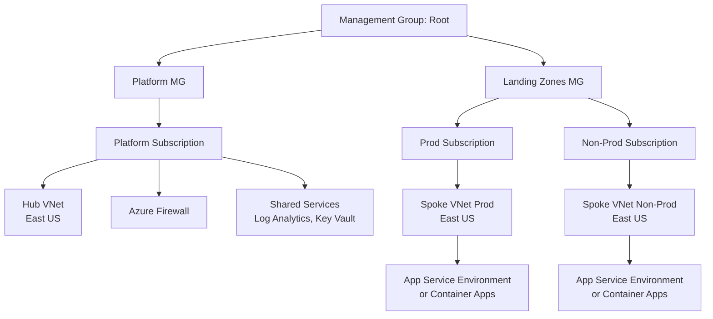
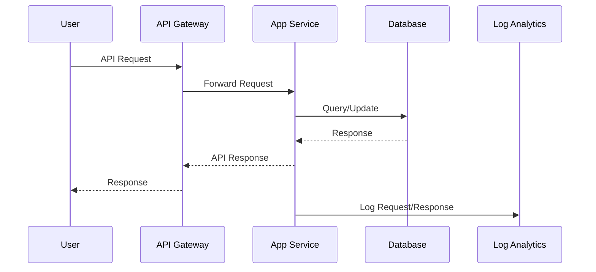

# Finance App — Azure Platform Architecture

## Context
The clarified requirements brief is as follows:

1. **Business context** — finance app, API only hit few times a day
2. **Target cloud** — Azure
3. **Regions / geography** — single region east us
4. **Compliance / regulatory** — no frameworks
5. **Connectivity** — cloud only
6. **Identity** — No identity reqs
7. **Scale & NFRs** — N/A
8. **Existing estate** — brownfield
9. **Team maturity** — guardrails
10. **Known constraints** — terraform github actions

Scope is platform-level: landing zone, networking, identity, management group hierarchy, shared services, observability, guardrails.

Explicit assumptions: Since the existing estate is brownfield but no details provided, assume an existing Azure tenant with minimal pre-existing resources. The platform design will build upon this, focusing on establishing a new landing zone structure. No specific identity requirements mentioned, but platform-level identity foundations will be included. Scale and NFRs are N/A, so design for low-traffic API with room for growth. Team maturity indicates a need for strong guardrails to prevent misconfigurations.

## Component diagram

## Data / control flow

## Design
### Tenant, management groups & subscriptions
- **What**: Use an existing Azure tenant (brownfield assumption). Establish a management group hierarchy: Root MG -> Platform MG (for shared services) and Landing Zones MG (for workloads). Platform subscription under Platform MG for hub networking and shared services. Separate subscriptions for Prod and Non-Prod under Landing Zones MG.
- **Why**: Aligns with Azure Landing Zones for governance and isolation. Single region simplifies, but subscriptions allow for environment separation.
- **Main tradeoffs**: Additional subscriptions increase management overhead but provide better cost tracking and policy isolation.
- **Alternatives rejected**: Flat subscription structure (rejected for lack of hierarchy and scalability); single subscription (rejected for no environment isolation).

### Identity & access
- **What**: Leverage Entra ID for user and service identities. Implement Privileged Identity Management (PIM) for elevated access. Use managed identities for services. Conditional access policies for security.
- **Why**: Platform foundation for secure access, even without specific app identity reqs. PIM reduces standing privileges.
- **Main tradeoffs**: PIM adds complexity for small teams but is essential for guardrails.
- **Alternatives rejected**: No PIM (rejected due to guardrails focus); external IdP (not needed as no reqs specified).

### Networking
- **What**: Hub-and-spoke topology in East US region. Hub VNet with Azure Firewall for egress and security. Spoke VNets for Prod and Non-Prod, peered to hub. Use Private DNS zones and Private Endpoints for secure connectivity.
- **Why**: Isolates workloads, centralizes security inspection. Cloud-only, so no VPN/ExpressRoute.
- **Main tradeoffs**: Hub-and-spoke adds latency for cross-VNet traffic but provides better security than flat networking.
- **Alternatives rejected**: Virtual WAN (overkill for single region); flat VNet (rejected for no isolation).

### Security & guardrails (Policy, Defender, Sentinel)
- **What**: Azure Policy at management group level for ALZ policy sets (e.g., tagging, encryption). Enable Defender for Cloud with all plans. Deploy Azure Sentinel for SIEM. Key Vault for secrets management.
- **Why**: Team maturity emphasizes guardrails; policies prevent misconfigs. Defender provides threat detection.
- **Main tradeoffs**: Policies can be restrictive, slowing deployments, but necessary for compliance readiness.
- **Alternatives rejected**: Minimal policies (rejected due to guardrails req); no Sentinel (rejected for observability gaps).

### Observability
- **What**: Centralized Log Analytics workspace in Platform subscription. Azure Monitor for metrics/dashboards. Application Insights for app telemetry. Diagnostic settings via policy.
- **Why**: Enables monitoring of low-traffic API. Centralized for cost efficiency.
- **Main tradeoffs**: Centralized logs may have higher latency but simpler management.
- **Alternatives rejected**: Per-subscription workspaces (higher cost for small scale).

### Compute & workload landing pattern
- **What**: Use Azure App Service (or Container Apps for future flexibility) in spoke VNets. API hosted as serverless or PaaS for low traffic.
- **Why**: Simple for API-only, low hits. App Service provides built-in scaling and security.
- **Main tradeoffs**: App Service less flexible than AKS but easier for low maturity teams.
- **Alternatives rejected**: AKS (overkill for simple API); VMs (higher management).

### Data, backup, DR
- **What**: Azure SQL Database or Cosmos DB for data. Azure Backup for VMs/resources. Geo-redundant storage for blobs. DR via paired region (though single region primary).
- **Why**: Finance app needs reliable data storage. Backup for recovery.
- **Main tradeoffs**: Geo-redundancy increases cost but improves reliability.
- **Alternatives rejected**: No DR (rejected for finance criticality); on-prem backup (not cloud-only).

### CI/CD integration
- **What**: GitHub Actions with OIDC federation to Entra ID for secure deployments. Terraform for IaC.
- **Why**: Specified constraints. OIDC avoids long-lived secrets.
- **Main tradeoffs**: OIDC setup adds initial complexity but improves security.
- **Alternatives rejected**: Azure DevOps (not specified); manual deployments (rejected for automation).

## Well-Architected mapping
### Reliability
Amber: Single region limits availability; add paired region for DR to improve. Hub-and-spoke provides isolation but no cross-region failover.

### Security
Green: Strong guardrails with Policy, Defender, PIM. Private endpoints and firewall enhance protection.

### Cost Optimization
Green: Low-traffic API minimizes compute costs. Shared services reduce duplication.

### Operational Excellence
Amber: Centralized observability good, but team may need training on tools. Terraform/GitHub Actions enable automation.

### Performance Efficiency
Green: App Service scales automatically; single region reduces latency.

## ALZ / CAF alignment
This design closely follows Azure Landing Zones: management group hierarchy, hub-and-spoke networking, shared services subscription, policy-driven guardrails. Aligns with CAF principles for governance and security. No deviations, as it matches the reference architecture for enterprise-scale platforms.

## Risks and open questions
- Integration with existing brownfield estate: What pre-existing resources (e.g., subscriptions, VNets) exist that need integration?
- Identity specifics: Are there existing Entra ID setups or external IdPs to consider?
- Scale growth: If API traffic increases, will App Service suffice, or need migration to AKS?
- Compliance: No frameworks specified, but finance may imply PCI/SOX; confirm if needed.

## Cost envelope
Small (S): Low-traffic API in single region keeps costs minimal. Top drivers: Azure Firewall (~$1k/month), Log Analytics (~$500/month), App Service (~$200/month), Storage/Backup (~$100/month), Defender (~$50/month).
